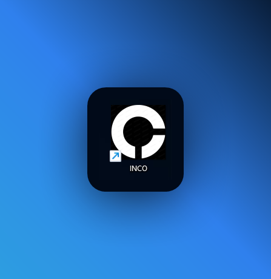
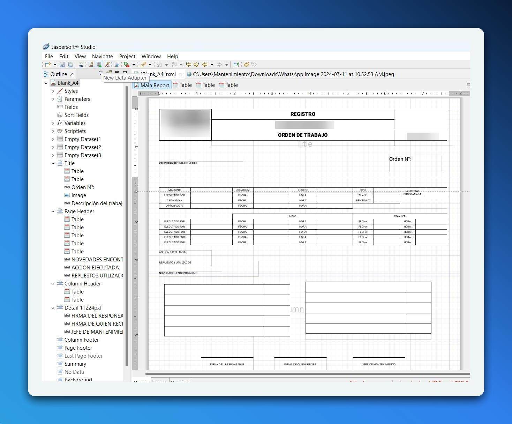
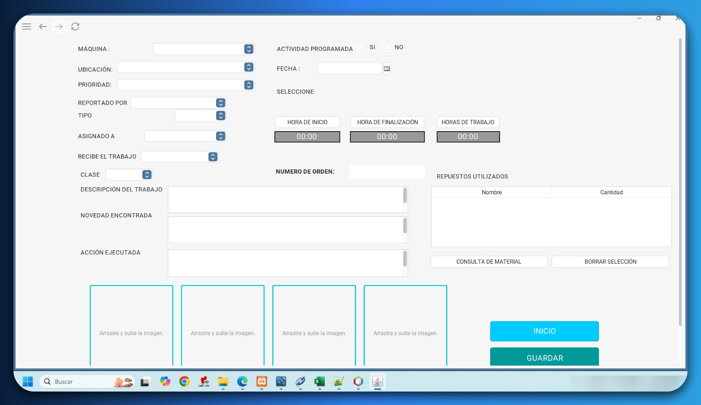
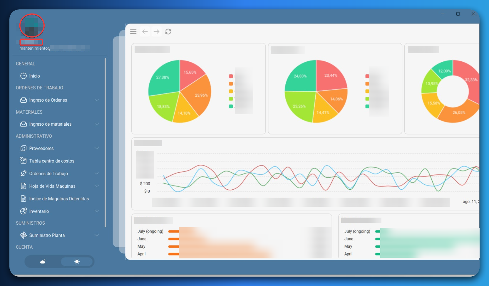

# SISTEMA-DE-CONTROL-DE-INVENTARIO-Y-ORDENES-DE-TRABAJO
# Mantenimiento INCO 

Mantenimiento INCO es una aplicación de software diseñada desde cero para la gestión de mantenimiento en la planta "INCO". Desarrollada en NetBeans 21 con Java, se integra con una base de datos local y proporciona funcionalidades como gestión de órdenes de trabajo, generación de informes en formato PDF para ser firmados y almacenados en la nube o plataforma de la empresajunto con el análisis en un panel de control. El software incluye autenticación de usuario con inicio de sesión y contraseña por medio de jerarquias TRABAJADORES/ADMINISTRADOR/JEFE DE AREA para evitar la infiltracion o lectura de datos por parte de usuarios no autorizados, asi mismo 

## Características
- **Gestión de Órdenes de Trabajo:** Crear, asignar y rastrear órdenes de trabajo de mantenimiento.
- **Integración con Jasper Reports:** Generar e imprime informes detallados de mantenimiento en formato PDF previamente completados y los almacena en la nube o equipo.
- **Panel de Control Analítico:** Visualizar datos de mantenimiento con gráficos para ingresos, gastos y más.
- **Autenticación de Usuario:** Sistema de inicio de sesión seguro para gestionar el acceso.
- **Base de Datos Local:** Utiliza una base de datos SQL local para almacenar todos los datos relacionados con el mantenimiento.
- **Formularios Dinámicos:** Formularios de entrada para órdenes de trabajo con datos de máquinas,hojas de vida, repuestos del inventario.
- **Gestion de inventario:** Formularios de busqueda y alojamiento de todos los items de bodega para añadir,editar y borrar dicho objeto solicitado por el obrero.
## Software Final 
### 1. INCO DISEÑO FINAL


### 2. Reportes profesionales en PDF con Jasper Reports


### 3. Formulario de Orden de Trabajo


### 4. Panel de Control 


## Tecnologías Utilizadas
- **Java:** Lenguaje principal para la aplicación.
- **NetBeans 21:** IDE utilizado para el desarrollo.
- **Base de Datos SQL:** Base de datos local para almacenar datos de mantenimiento.
- **Jasper Reports:** Para generar informes en PDF.
- **Swing,Fx333:** Utilizado para construir la interfaz gráfica de usuario.


### Prerrequisitos
- Java JDK 8 o superior
- NetBeans 21
- MySQL o cualquier base de datos SQL local
- Biblioteca JasperReports

### Instalación
1. Clonar el repositorio:
   ```bash
   git clone https://github.com/tu-usuario/Mantenimiento-INCO.git
